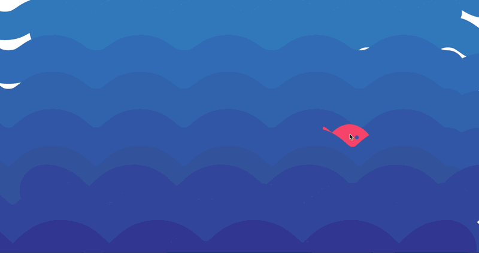
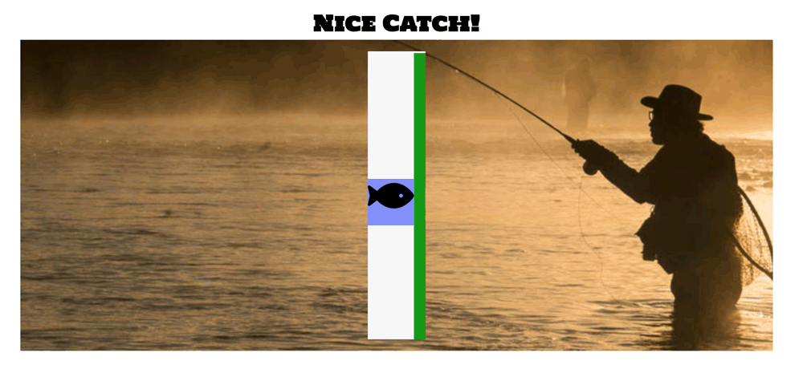

# Fish The Big One

**The Big One** is out there, you just need to catch it. 

## Hook and Reel

**Use your mouse to stalk** the elusive fish as it darts behind the crashing waves. 

As the fish tries to escape it will drag the blue square downward, **crank the reel using your keyboard or mouse** to keep fishy inside of the blue square

**The Big One is yours** when the status bar turns green. 

## Built with Javascript, CSS, SVG, HTML, and WebAudio API
A page with working sound files can be seen [here](https://dotkalm.github.io/fishing/).

#Author
Joel Holmberg

#Acknowledgements
[Web Audio MDN docs] (https://developer.mozilla.org/en-US/docs/Web/API/Web_Audio_API/Using_Web_Audio_API)

[SVG MDN docs] (https://developer.mozilla.org/en-US/docs/Web/SVG)

Inspiration for this game came from 
[Stardew Valley](https://www.stardewvalley.net/)

